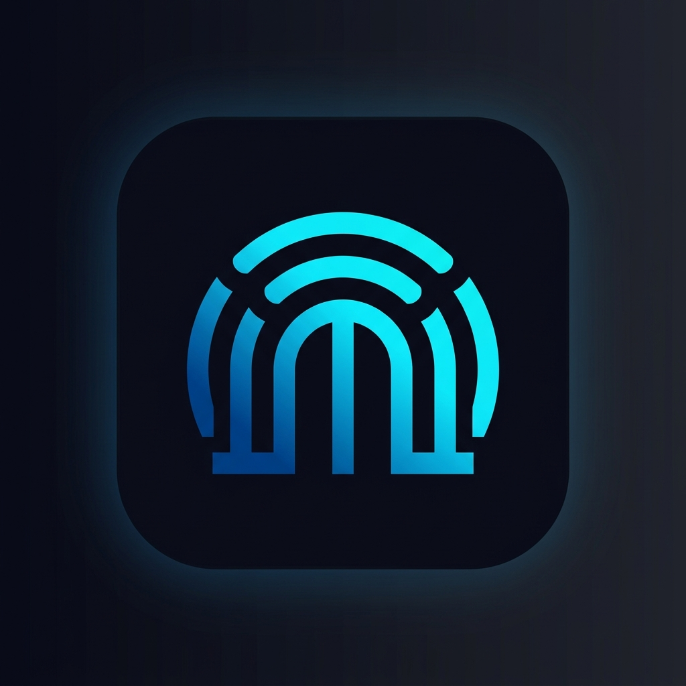

<div align="center">
  
  <br/>
  <h1>🚀 Gate VPN 🛡️</h1>
  <p>
    <strong>A next-generation, blazingly fast, and highly secure Virtual Private Network (VPN) client for Android.</strong><br/>
    <em>Engineered with Flutter. Powered by OpenVPN. Open for everyone.</em>
  </p>
  
  <p>
    <a href="https://flutter.dev">
      
    </a>
    <a href="https://dart.dev">
      
    </a>
    <a href="https://openvpn.net/">
      
    </a>
    <a href="https://riverpod.dev/">
      
    </a>
    <a href="https://choosealicense.com/licenses/mit/">
      
    </a>
  </p>
</div>

---

## 🌟 Why Gate VPN?

Gate VPN isn't just another VPN app. It seamlessly connects you to a massive network of hundreds of **free, community-driven, open-source VPN servers** globally via the [VPNGate](https://www.vpngate.net/) project. 

Whether you need to bypass geographical restrictions, secure your data on public Wi-Fi, or ensure your browsing remains private, Gate VPN is built to deliver **maximum performance** with a frictionless user experience.

<br/>

## ✨ Key Features

| Feature | Description |
| :--- | :--- |
| ⚡ **Zero-Friction Connect** | One tap. That's all it takes to find and connect to the absolute best server available. No accounts, no subscriptions, no hassle. |
| 🌍 **Massive Global Network** | Instantly browse, filter, and connect to hundreds of servers located in almost every country across the globe. |
| 📊 **Live Telemetry & Metrics** | Real-time monitoring built straight into the UI. Watch your active connection duration, server ping (ms), and byte transfer speeds. |
| 🚀 **Asynchronous Smart Caching** | Server lists are parsed on isolated threads and cached using a 6-hour `stale-while-revalidate` policy. The UI never drops a frame. |
| 🔔 **Persistent Background Tracking** | Gate VPN runs securely in the background, utilizing native Android notifications to keep you informed of your connection status at a glance. |
| 🔄 **Intelligent Auto-Reconnect** | Connection dropped? Gate VPN instantly detects the failure and automatically hunts for the next most optimal server to restore your session. |

<br/>

## 🛠️ Architecture & Tech Stack

Gate VPN was engineered for **scalability, maintainability, and clean code**. It strictly follows a highly modular **Feature-Based MVVM Architecture**.

### The Stack:
- **UI & Core Framework:** Flutter (Dart)
- **State Management:** [Riverpod 2.0](https://pub.dev/packages/flutter_riverpod) for reactive, immutable, and testable state.
- **Native Tunneling:** [openvpn_flutter](https://pub.dev/packages/openvpn_flutter) (Bridging OpenVPN C++ core to Dart).
- **Persistent Caching:** [flutter_cache_manager](https://pub.dev/packages/flutter_cache_manager) for smart file retrieval.
- **Heavy Data Parsing:** Offloaded entirely to background isolates using `compute()` to parse massive CSV files from VPNGate without stuttering the 60fps UI.

### Directory Structure:
```text
lib/
 ├── core/
 │    ├── network/          # Intelligent API Services & Caching Engine
 │    ├── routing/          # Centralized and strongly typed AppRouter
 │    └── services/         # Native Notification bridging
 └── modules/
      └── vpn/
           ├── logic/       # The Brain: VpnNotifier & VpnState (Riverpod)
           ├── models/      # Data schemas (VpnServer)
           ├── providers/   # Global Dependency Injection graph
           ├── repositories/# Abstraction over the Native OpenVPN layer
           └── screens/     # Pure, stateless UI components
```

<br/>

## 🚀 Getting Started

Want to build it yourself? Let's get you set up in minutes.

### 1. Prerequisites
Ensure you have the following installed:
* [Flutter SDK](https://docs.flutter.dev/get-started/install) (v3.10 or higher)
* Android Studio (with Android SDK & NDK installed)
* A physical Android device or Emulator (Running API 21+)

### 2. Installation

Clone the repository to your local machine:
```bash
git clone git@github.com:hamzaali265/gate_vpn.git
cd gate_vpn
```

Fetch the dependencies:
```bash
flutter pub get
```

Fire it up:
```bash
flutter run
```

> ⚠️ **Important Native Note:** OpenVPN on Android inherently requires the system-level `VpnService` permission to create a secure tunnel. The app will automatically prompt the user to grant this OS-level permission upon their very first connection attempt.

<br/>

## 🤝 Contributing

We welcome contributions of all sizes! Whether it's a bug fix, new feature, or documentation improvement.

1. Fork the Project
2. Create your Feature Branch (`git checkout -b feature/AmazingFeature`)
3. Commit your Changes (`git commit -m 'Add some AmazingFeature'`)
4. Push to the Branch (`git push origin feature/AmazingFeature`)
5. Open a Pull Request

<br/>

## 📄 License

This project is licensed under the [MIT License](https://choosealicense.com/licenses/mit/) - see the LICENSE file for details.
